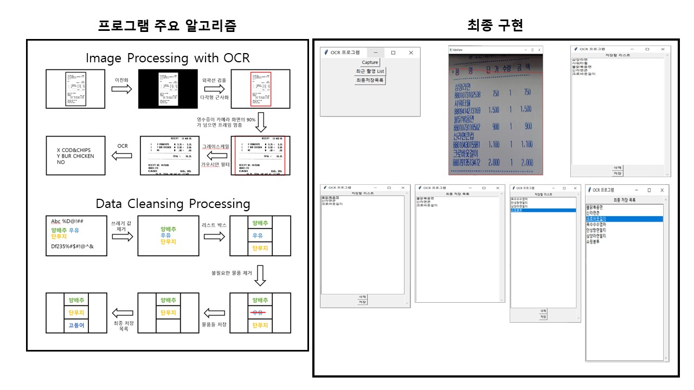

# OCR_Project
Project name:

OCR Project : To implement smart kitchen

## Outline
This is personal term project by dongwooky for studying Computer Vision 

## Language

- Python

## Library
- OpenCV
- Tesseract
- Regular Expressions
- Tkinter

## Algorithm

## Details
식자재들을 데이터화해 활용하는 스마트 키친을 구현하기 위한 프로젝트. 

영수증을 스캔해 식자재들을 데이터화하고 편의대로 데이터를 삭제 또는 저장할 수 있는 프로그램이다.

 Python 언어로 개발을 시행했고 프로그램을 구현할 하드웨어 모듈로는 ‘라즈베리파이’를 사용하였다. 
 프로그램을 GUI로 사용자가 쉽게 작동할 수 있게 구현하였다. 

 구현한 주요 알고리즘으로는 이미지에서 영수증을 특정할 수 있는 외곽선 검출 알고리즘과 OCR 인식률을 높이기 위한 전처리 과정 알고리즘이다. 

 또한 인식한 데이터를 정리하는 데는 정규표현식이 사용되었다. 

## Adds
If you want to read final code, you can find it in the folder name &#60;code&#62;

- Current final code : ocr_project_1.0.0.py

If you want to read document (project_proposal, final_presentation, final_report) you can find it in the folder name &#60;document&#62;

- Project Proposal : project_proposal.pptx
- Final Presentation : fianal_presentation.pptx
- Final Report : final_report.docx